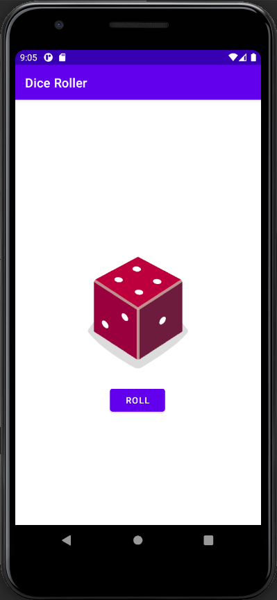
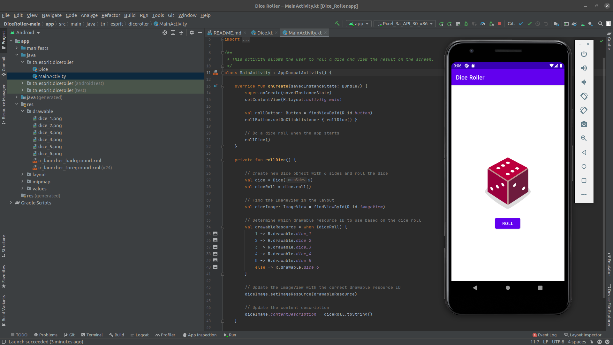

# <p align="center">Dice Roller</p>

## Table of Content

- [Introduction](#introduction)
- [Environment](#environment)
- [Galleries](#galleries)

# Introduction

Dice Roller is an Android app where users can click a ```Button``` in the app to roll virtual dice using true randomness .

This project was created by:
- [Mohamed Aziz Mhadhbi](https://www.linkedin.com/in/mohamedaziz-mhadhbi-1951411ba/)

# Environment

This project is interpreted/tested on Ubuntu 20.04 LTS using Kotlin gradle (Version 7.0.2)

# Galleries



